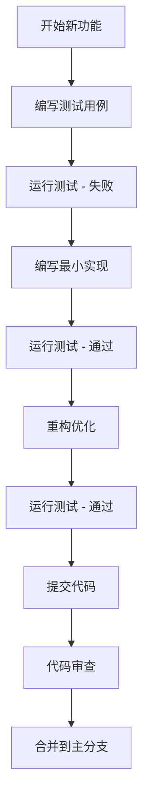

# TDD 开发工作流程

本文档详细说明了 Axis-UI 项目中的测试驱动开发（TDD）工作流程，包括开发规范、最佳实践和自动化工具配置。

## 🎯 工作流程概览



## 📋 开发规范

### 1. 分支命名规范

```bash
# 功能开发
feature/component-name
feature/button-component

# 问题修复
fix/issue-description
fix/button-click-event

# 文档更新
docs/update-readme
docs/add-component-docs

# 重构
refactor/component-structure
```

### 2. 提交信息规范

使用 [Conventional Commits](https://www.conventionalcommits.org/) 规范：

```bash
# 功能开发
feat: add button component with variants
feat(button): add loading state support

# 问题修复
fix: resolve button click event not firing
fix(button): fix disabled state styling

# 文档更新
docs: update button component documentation
docs(api): add button props table

# 测试相关
test: add button component tests
test(button): add accessibility tests

# 构建相关
build: update vite configuration
chore: update dependencies
```

### 3. 测试文件命名规范

```
test/
├── components/
│   ├── button/
│   │   ├── button.spec.ts          # 单元测试
│   │   ├── button.integration.spec.ts  # 集成测试
│   │   └── button.e2e.spec.ts      # 端到端测试
│   └── icon/
│       └── icon.spec.ts
├── utils/
│   └── test-helpers.ts
└── setup/
    └── index.ts
```

## 🧪 测试策略

### 1. 测试金字塔

```
        /\
       /  \
      / E2E \     <- 少量端到端测试
     /______\
    /        \
   /Integration\  <- 适量集成测试
  /____________\
 /              \
/   Unit Tests   \  <- 大量单元测试
/________________\
```

### 2. 测试类型说明

#### 单元测试 (Unit Tests)

- **目标**: 测试单个函数或组件
- **范围**: 组件内部逻辑、工具函数
- **工具**: Vitest + Vue Test Utils
- **覆盖率要求**: 80%+

```typescript
// test/components/button/button.spec.ts
describe('AxButton', () => {
  it('should render with default props', () => {
    const wrapper = mount(AxButton)
    expect(wrapper.classes()).toContain('ax-button')
  })
})
```

#### 集成测试 (Integration Tests)

- **目标**: 测试组件间的交互
- **范围**: 父子组件通信、事件处理
- **工具**: Vitest + Vue Test Utils
- **覆盖率要求**: 60%+

```typescript
// test/components/button/button.integration.spec.ts
describe('AxButton Integration', () => {
  it('should emit click event when clicked', async () => {
    const wrapper = mount(AxButton)
    await wrapper.trigger('click')
    expect(wrapper.emitted('click')).toBeTruthy()
  })
})
```

#### 端到端测试 (E2E Tests)

- **目标**: 测试完整用户流程
- **范围**: 关键业务流程
- **工具**: Playwright (推荐) 或 Cypress
- **覆盖率要求**: 核心功能 100%

```typescript
// test/e2e/button.spec.ts
test('button click workflow', async ({ page }) => {
  await page.goto('/components/button')
  await page.click('[data-testid="demo-button"]')
  await expect(page.locator('.success-message')).toBeVisible()
})
```

## 🛠️ 开发工具配置

### 1. VS Code 配置

```json
// .vscode/settings.json
{
  "vitest.enable": true,
  "vitest.commandLine": "pnpm test",
  "editor.codeActionsOnSave": {
    "source.fixAll.eslint": true,
    "source.organizeImports": true
  },
  "files.associations": {
    "*.spec.ts": "typescript",
    "*.test.ts": "typescript"
  }
}
```

### 2. Git Hooks 配置

```bash
# .husky/pre-commit
#!/usr/bin/env sh
. "$(dirname -- "$0")/_/husky.sh"

# 运行 lint-staged
npx lint-staged

# 运行测试
pnpm test:ci
```

### 3. CI/CD 配置

```yaml
# .github/workflows/test.yml
name: Test

on:
  push:
    branches: [main, develop]
  pull_request:
    branches: [main]

jobs:
  test:
    runs-on: ubuntu-latest

    steps:
      - uses: actions/checkout@v3

      - name: Setup Node.js
        uses: actions/setup-node@v3
        with:
          node-version: '18'

      - name: Setup pnpm
        uses: pnpm/action-setup@v2
        with:
          version: 8

      - name: Install dependencies
        run: pnpm install --frozen-lockfile

      - name: Run tests
        run: pnpm test:ci

      - name: Upload coverage
        uses: codecov/codecov-action@v3
        with:
          file: ./coverage/lcov.info
```

## 📊 质量指标

### 1. 覆盖率要求

| 指标       | 要求  | 说明             |
| ---------- | ----- | ---------------- |
| 行覆盖率   | ≥ 80% | 代码行执行覆盖率 |
| 分支覆盖率 | ≥ 80% | 条件分支覆盖率   |
| 函数覆盖率 | ≥ 80% | 函数调用覆盖率   |
| 语句覆盖率 | ≥ 80% | 语句执行覆盖率   |

### 2. 性能指标

| 指标         | 要求    | 说明                 |
| ------------ | ------- | -------------------- |
| 测试执行时间 | < 30s   | 完整测试套件执行时间 |
| 组件渲染时间 | < 100ms | 单个组件渲染时间     |
| 包大小增长   | < 10%   | 每次发布包大小增长   |

## 🔄 开发流程

### 1. 开始新功能

```bash
# 1. 创建功能分支
git checkout -b feature/new-component

# 2. 启动测试监听
pnpm test:watch

# 3. 启动开发服务器
pnpm dev
```

### 2. TDD 循环

```bash
# 1. 编写测试 (Red)
# 在 test/ 目录下创建测试文件

# 2. 运行测试确认失败
pnpm test

# 3. 编写最小实现 (Green)
# 在 packages/ 目录下实现功能

# 4. 运行测试确认通过
pnpm test

# 5. 重构优化 (Refactor)
# 在测试通过的基础上优化代码

# 6. 运行测试确认重构成功
pnpm test
```

### 3. 代码审查

```bash
# 1. 提交代码
git add .
git commit -m "feat: add new component"

# 2. 推送分支
git push origin feature/new-component

# 3. 创建 Pull Request
# 在 GitHub 上创建 PR

# 4. 代码审查
# 等待审查者反馈

# 5. 合并代码
# 审查通过后合并到主分支
```

## 📚 最佳实践

### 1. 测试编写

- **AAA 模式**: Arrange, Act, Assert
- **单一职责**: 每个测试只验证一个行为
- **描述性命名**: 测试名称应该清楚描述测试内容
- **独立性**: 测试之间不应该有依赖关系

### 2. 组件设计

- **单一职责**: 每个组件只负责一个功能
- **可复用性**: 组件应该可以在不同场景下复用
- **可测试性**: 组件应该易于测试
- **类型安全**: 使用 TypeScript 确保类型安全

### 3. 文档维护

- **同步更新**: 代码和文档同步更新
- **示例完整**: 提供完整的使用示例
- **API 文档**: 详细的 API 文档
- **变更日志**: 记录每次变更

## 🚀 自动化工具

### 1. 测试自动化

```bash
# 监听模式
pnpm test:watch

# 覆盖率报告
pnpm test:coverage

# UI 模式
pnpm test:ui

# CI 模式
pnpm test:ci
```

### 2. 代码质量

```bash
# 代码检查
pnpm lint

# 代码格式化
pnpm format

# 类型检查
pnpm type-check
```

### 3. 构建部署

```bash
# 构建组件库
pnpm build

# 构建文档
pnpm docs:build

# 预览文档
pnpm docs:preview
```

## 📈 持续改进

### 1. 定期回顾

- **每周回顾**: 回顾测试覆盖率和质量指标
- **每月回顾**: 回顾开发流程和工具配置
- **季度回顾**: 回顾整体架构和策略

### 2. 工具升级

- **依赖更新**: 定期更新依赖包
- **工具优化**: 根据使用情况优化工具配置
- **流程改进**: 根据团队反馈改进流程

### 3. 知识分享

- **技术分享**: 定期分享 TDD 最佳实践
- **文档更新**: 持续更新开发文档
- **培训计划**: 为新成员提供 TDD 培训
